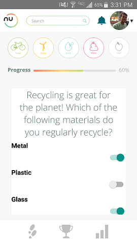

# nu.world Mobile Version

### Overview

nu.world is an environmentally conscious social media app. It's built around an environmental tool called a carbon calculator. Users input information about their lifestyles, such as how much they drive and how much water they use, and the calculator outputs the user's calculated carbon emissions.

Users can customize their profile, go through the calculator and see stats about their emissions, and push themselves to decrease their impact with some suggested challenges. 

### Major Technologies
* React Native
* Node.js
* JSON Web Tokens
* PostgreSQL
* Amazon S3

### Log-In/Sign-Up

### Main Profile

### Edit Profile

### Carbon Calculator

### Stats Page

### Challenges

### Database

The PostgreSQL database stores: 
  * User information, including login information and a link to the S3 storage location for their profile picture.
  * Calculated emissions data, with a foreign key to the proper user
 
 S3 contains all user uploaded photos.
