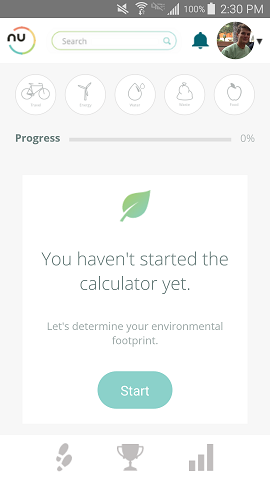
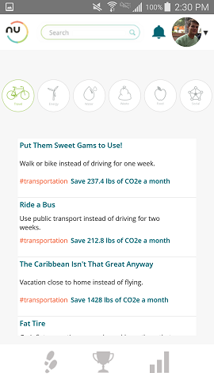

# nu.world Mobile Version

### Overview

nu.world is an environmentally conscious social media app. It's built around an environmental tool called a carbon calculator. Users input information about their lifestyles, such as how much they drive and how much water they use, and the calculator outputs the user's calculated carbon emissions.

Users can customize their profile, go through the calculator and see stats about their emissions, and push themselves to decrease their impact with some suggested challenges. 

This app was created in a three week period in November/December of 2016. One week to learn React/React Native, JSON Web Tokens, and the Android build environment, and two weeks to build.

### Major Technologies
* React Native
* Node.js
* JSON Web Tokens
* PostgreSQL
* Amazon S3

### Log-In/Sign-Up

Log-in and sign-up authentication is handled by JSON web tokens. The only practical difference between the two is that sign-up will create a new user on the Postgres database, while log-in verifies that the email and password combination exists on the database. In either case, the user is passed a JSON web token which is kept on the phone's async storage so the user can skip log-in the next time they open the app.

### Main Profile

Here is the user's main profile. The followers are a placeholder for the moment, but the banner user info is customizable (see edit profile). The linear-gradient bar is a progress bar, comparing the user's calculated emissions to the US national goal for 2025 (when the country is hoping to reduce emisions by 26-28%). This was implemented by laying a plain gray div over the brightly colored div, and giving the gray div a width proportionate to the user's calculated emissions. The profile photo is kept in Amazon's S3, with the proper link for the user in the database. 

### Edit Profile

Here the user has the option to change their title, thier interests, and their photo. Changing the title or interests updates the user's title or interests properties on the database. To change the photo, the user can choose to take a photo using the phone's camera, or they can upload a photo from their gallery. This is done with the React Native Image Picker package. I'd like to take the time to thank whoever built that, because it was far and away the smoothest React Native experience of this whole project. Once the user chooses a new photo, it is uploaded to Amazon S3, and the link to the new photo is attached to the user object on the database. 

### Carbon Calculator

This page is a series of components inside the larger calculator component. You can see in the two photos that as the user moves through the calculator a progress bar updates, and the icons change color to keep up with which part of the calculator the user is on. Each sub-component is a form specific to a certain aspect of the calculator. User input is compared to data gathered mostly from US gov't sources to determine emissions, and is then sent to the database with a foreign key linking it to the proper user. 

The research behind this portion of the app was extensive, but within the app itself the lifting is relatively light. Although each question may have dozens of different sources and variables informing it, the app itself only has to deal with one simple equation for each question.

### Stats Page

This is a visual layout of the user's emissions. The top left is their total footprint. The top right is a comparison of their data against the US goal to reduce emissions. The colored bar is a visual representation of their emissions compared to the average individual emissions of the stated goals. The bar loses color as the user drops below 100% of their share of emissions, which was done by laying a gray div over the colored one and giving it a width proportionate to user emissions. The middle right is a representation of how many of the Earth's resources are necessary to support the user's lifestyle, based on their footprint. At the bottom is a breakdown of user emissions by category. And on the left is the leaderboard of different users. Like other social features of the app, this has not yet been implemented. But it looks neat!

### Challenges

This page displays challenges that users can undertake to reduce their carbon emissions. Challenges are divided into categories, viewable by touching the proper icon. The challenges are all kept in a single array, then mapped and displayed according to the category currently selected. The icons are colored in a similar matter. 

### Database and Server

The PostgreSQL database stores: 
  * User information, including login information and a link to the S3 storage location for their profile picture.
  * Calculated emissions data, with a foreign key to the proper user
 
 S3 contains all user uploaded photos.
 
 The server is run with Node.js on a Ubuntu 16 Digital Ocean Droplet. Because this is a mobile app, the server is not responsible for serving any front-end information. Instead, it handles user authentication and calls to the database to create, update, or read user and emissions information. 
